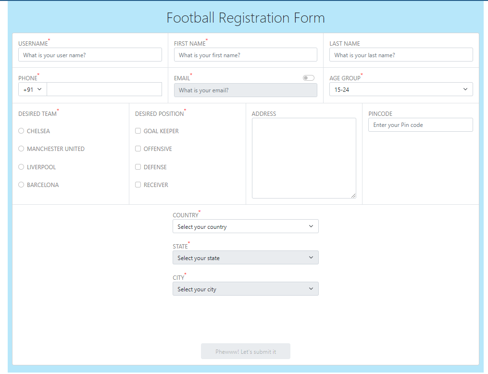

# FootballRegistrationForm

<!--  -->

# Football Registration Form

> A football form to register for football club.

        <!-- PROJECT SHIELDS -->
        <a href="https://vscode.dev/github/AmitKumar2301/FootballRegistrationForm">
            </img>
        </a>
        <a href="https://github.com/AmitKumar2301/FootballRegistrationForm/">
            </img>
        </a>
         
        <a href="https://github.com/AmitKumar2301/FootballRegistrationForm/issues">Report Bug</a> ·
        <a href="https://github.com/AmitKumar2301/FootballRegistrationForm/issues">Request Feature</a>

<!-- TABLE OF CONTENTS -->

  
Table of Contents

  <ol>
    <li>
      <a href="#about-the-project">About The Project</a>
      <ul>
        <li><a href="#built-with">Built With</a></li>
      </ul>
    </li>
    <li>
      <a href="#getting-started">Getting Started</a>
      <ul>
        <li><a href="#prerequisites">Prerequisites</a></li>
        <li><a href="#installation">Installation</a></li>
      </ul>
    </li>
    <li><a href="#usage">Usage</a></li>
    <li><a href="#contributing">Contributing</a></li>
    <li><a href="#license">License</a></li>
    <li><a href="#contact">Contact</a></li>
    <li><a href="#acknowledgments">Acknowledgments</a></li>
  </ol>

 

## License

GNU General Public License v3.0

---

> GitHub [@AmitKumar2301](https://github.com/AmitKumar2301) &nbsp;&middot;&nbsp;

